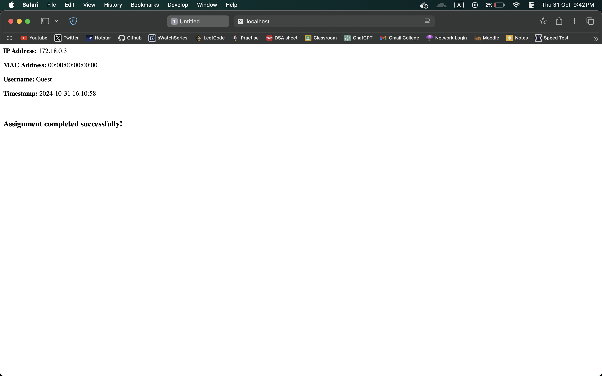

# Project Setup with Docker

This project uses Docker to containerize the application. Below are the changes made to the Docker and configuration files for better functionality and accuracy.

link: http://34.131.89.250

## Changes Made

### 1. `docker-compose.yaml`
   - **Port Number Correction**:
     - Changed the value from `"eighty:80"` to `"80:80"` as port numbers cannot be strings.
   - **Path Correction**:
     - Updated the path from `".confi"` to `".conf"`.
   - **Port Update**:
     - Changed `"eight thousand"` to `8000`.
   - **Network Driver Correction**:
     - Changed `"bridg"` to `"bridge"`.
   - **Changing command**:
     - Updated the command from `"expose"` to `"ports"` so that the port can be accessed publically.

### 2. `nginx/Dockerfile`
   - **Version Tag Update**:
     - Changed `FROM nginx:latests` to `FROM nginx:latest`.
   - **Typo Fix in Image Name**:
     - Corrected `"nginix"` to `"nginx"`.
   - **HTML Directory Removal**:
     - Removed the line `COPY ./html /usr/share/nginx/html` as there was no HTML file to copy.
   - **Port Number Correction**:
     - Changed `"Eighty"` to `80`.
   - **Command Fix**:
     - Updated the command from `"daemon of;"` to `"daemon off;"`.

### 3. `nginx/nginx.conf`
   - **Worker Processes**:
     - Corrected `worker_process auto` to `worker_processes auto`.
   - **MIME Types Typo**:
     - Fixed `"mime.typess"` to `"mime.types"`.
   - **Default Type Typo**:
     - Changed `"default_typ"` to `"default_type"`.

### 4. `Python/Dockerfile`
   - **Directory Name Correction**:
     - Changed `"appp"` to `"app"`.
   - **App File Name**:
     - Corrected `"appy.py"` to `"app.py"`.
   - **Library Name**:
     - Fixed the library name from `"netiface"` to `"netifaces"`.
   - **Port Number Update**:
     - Changed `"eight thousand"` to `8000`.
   - **Command Correction**:
     - Updated the command from `"pythn"` to `"python"`.
    

